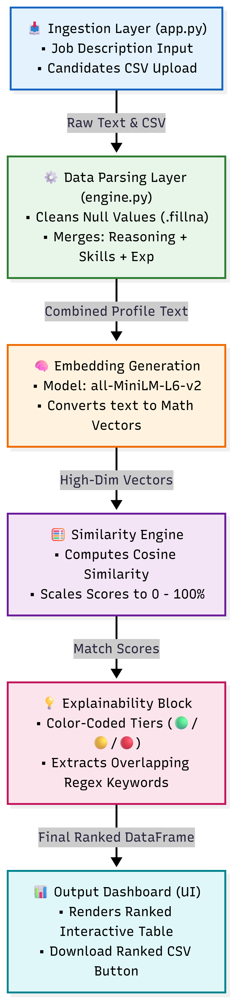

# 🚀 Intelligent Candidate Discovery System

A Skill-Synergy based smart hiring platform built with Python and Streamlit, featuring semantic ranking and AI Explainability. 

**Developer:** Mohd Gulam Moinuddin Ramzan Sheikh

---

## 📌 Project Overview
Traditional recruitment processes rely heavily on primitive keyword matching, which misses context and soft alignment. This system solves that problem by using high-dimensional vector embeddings to analyze candidate profiles (reasoning, skills, and experience) against a Job Description, ranking them dynamically with mathematical precision and providing human-readable explanations.

---

## 🏗️ System Architecture & Pipeline

The system is designed following the **Separation of Concerns (SoC)** principle, separating the frontend presentation layer (`app.py`) from the core computational logic (`engine.py`).

### 📊 System Architecture Flowchart
*(Note: Ensure your flowchart image is uploaded in the repository with the file name `flowchart.png`)*



### 🔄 Data Flow Pipeline
1. **Ingestion Layer (`app.py`):** Captures user-defined Job Descriptions and accepts automated bulk profile inputs via CSV.
2. **Structural Parsing Layer (`engine.py`):** Cleans missing data records natively using Pandas `.fillna("")`. It dynamically concatenates candidate fields into a unified context block:
   
   $$\text{Combined Profile Text} = \text{Reasoning} + \text{Skills} + \text{Experience Years}$$
   
3. **Model Execution Layer:** Utilizes the pretrained **`all-MiniLM-L6-v2`** Bi-Encoder architecture to convert the inputs into dense vector representations.
4. **Similarity Core:** Computes structural proximity using **Cosine Similarity**, scaling the mathematical dot-products directly into a clear percentage scale ($0 - 100\%$):
   
   $$\text{Similarity}(A, B) = \frac{A \cdot B}{\|A\| \|B\|}$$
   
5. **Explainability Block:** Segregates scores into custom recruitment categories (🟢 High, 🟡 Moderate, 🔴 Low) and implements optimized Regex tokenization to extract exact overlapping keywords.

---

## 📂 Project Repository Structure
```text
├── app.py                  # Streamlit Interface & Presentation Layer
├── engine.py               # Computational Core, NLP Parsing & Model Logic
├── flowchart.png           # System Architecture Diagram
└── requirements.txt        # Managed Python Project Dependencies


